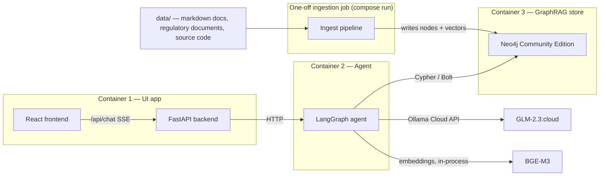

# GraphRAG Agent PoC

A proof-of-concept **GraphRAG-powered agent** that answers questions across an internal corpus of IT-architecture documents, security guidance (OWASP), Australian regulatory material (APRA CPS 234 / CPS 230, ASIC, AUSTRAC, ACCC), and source code — combining vector retrieval with knowledge-graph traversal to produce graph-grounded, **cited** answers.

The whole stack runs locally on a Mac (Rancher Desktop) with three Docker Compose containers:

1. **UI app** — React frontend + FastAPI backend for chat-style retrieval
2. **Agent** — a LangGraph agent with hybrid retrieval, Text2Cypher and agentic routing
3. **Neo4j** — Community Edition as the GraphRAG store

A one-off ingestion job loads and extracts the source documents into the graph.

> **Status:** planning / greenfield — no code exists yet. This README documents the intended design; commands and ports are the contract the implementation will follow.

---

## Goals & non-goals

**Goals — the questions this PoC must answer:**

- Can a graph-backed agent connect *code-level controls* to their *governing regulatory clauses* (e.g. a repository control → CPS 234 clause) via multi-hop traversal?
- Does schema-guided GraphRAG extraction (via `neo4j-graphrag`) produce a graph worth traversing across three very different document classes?
- Is hybrid retrieval (dense + sparse + graph) measurably better than vector-only RAG on mixed structured/semi-structured/unstructured corpora?
- Are answers traceable — every claim backed by a citation to a source document/section (e.g. "CPS 234 ¶27")?

**Non-goals (out of scope for the PoC):**

- Production hardening: auth/RBAC, multi-tenancy, HA/clustering
- Fine-tuning or model training
- Deployment beyond a single Mac / Rancher Desktop
- Incremental/document-watcher ingestion (a roadmap item)

---

## Architecture



| Container | Tech | Responsibility | Port |
|---|---|---|---|
| 1 — UI app | React (Vite) + FastAPI (Uvicorn) | Chat UI; FastAPI proxies chat + streaming (SSE) to the agent over HTTP | `3000` (React), `8000` (FastAPI) |
| 2 — Agent | Python + LangGraph, `neo4j-graphrag` | Retrieval strategy routing, hybrid retrieval, Text2Cypher, citation assembly | `8001` |
| 3 — Neo4j | Neo4j Community Edition 5.x | Graph + vector store; single source of truth for the knowledge graph | `7474` (Browser), `7687` (Bolt) |
| ingest (one-off) | Python, `neo4j-graphrag`, BGE-M3 | Parse, chunk, embed, extract entities/relations; writes to Neo4j. Run with `docker compose run --rm ingest` | — |

---

## Components

### 1. UI app (Container 1)

- **React (Vite)** single-page chat interface: message list with streaming responses, rendered citations linking to source documents/sections, and a collapsible panel showing the agent's retrieval steps (route chosen, queries issued, graph traversals).
- **FastAPI backend** in the same container: exposes `/api/chat` (SSE streaming), forwards to the agent container, relays token streams back to the browser.
- Rationale: keeps the three-container topology simple — the browser never talks to the agent directly.

### 2. Agent (Container 2) — LangGraph

The agent is a LangGraph state machine. Proposed node flow:

```
route → rewrite → retrieve → (traverse?) → synthesize → cite
                       ↑__________↓  (iterate if insufficient)
```

| Capability | Description |
|---|---|
| **Agentic routing** | Classifies the query intent (lookup / relationship / compliance-mapping) and selects a retrieval strategy; rewrites vague queries into retrieval-friendly forms; loops back if retrieved context is insufficient |
| **Hybrid retrieval** | `neo4j-graphrag` retrievers over `Chunk` vector index — dense (BGE-M3, 1024-dim) + sparse (BM25) combined |
| **Text2Cypher** | Generates Cypher from the natural-language question against the known graph schema to traverse multi-hop relationships the vector index can't answer (e.g. *which code components relate to the control satisfying CPS 230 §23?*) |
| **Citations** | Every synthesized answer carries provenance: document id, title, section/heading, and clause number where applicable (regulatory docs keep their native numbering) |

### 3. Neo4j GraphRAG store (Container 3)

Neo4j Community Edition (Docker image `neo4j:5-community`). Proposed schema:

```cypher
// Document + chunk layer (retrieval)
(:Document {id, title, type, source_path})-[:HAS_CHUNK]->(:Chunk {id, text, embedding, section})
// vector index on Chunk.embedding (1024-dim, cosine)

// Knowledge layer (extraction, via neo4j-graphrag schema-guided prompts)
(:Entity {id, name, type})-[:RELATES_TO {type, source_chunk}]->(:Entity)
// Entity types seeded per document class (see Document corpus below)
```

### 4. Ingestion job (one-off)

Runs as a compose service but only via `docker compose run --rm ingest`. Pipeline:

1. **Parse** — walk `data/`, classify each file by document class (below).
2. **Chunk** — class-specific strategy:
   - *Code* → symbol/AST-aware chunking (module, class, function boundaries)
   - *Semi-structured markdown* → heading-hierarchy chunking (keeps section paths for citations)
   - *Unstructured regulatory/security docs* → semantic chunking; preserve clause numbers as metadata
3. **Embed** — BGE-M3 (dense + sparse) in-process, using Apple MPS on the host-adjacent run.
4. **Extract** — `neo4j-graphrag` `SchemaEntityConstraint`-style schema-guided entity/relation extraction with GLM-2.3:cloud.
5. **Write** — upsert `Document`/`Chunk`/`Entity` nodes into Neo4j; create/reuse the vector index.

Idempotent: re-running replaces documents by `source_path` (re-ingest a file by re-running the job).

---

## Document corpus

| Class | Structure | Examples | Extraction / retrieval strategy |
|---|---|---|---|
| Structured | Source code | Application and platform repositories | Symbol-aware chunking; entities = components, modules, functions, data flows; retrieval via Text2Cypher + graph adjacency |
| Semi-structured | Markdown with headings | IT-architecture docs, design & pattern documents | Heading-based chunking preserving the heading path; entities = patterns, principles, systems, dependencies |
| Unstructured — regulatory | Policies/acts (markdown/PDF) | APRA **CPS 234** (information security), **CPS 230** (operational risk), ASIC, AUSTRAC, ACCC material | Semantic chunking with clause-number metadata; entities = obligations, control types, regulated entities, clauses |
| Unstructured — security | Standards & guides | OWASP (Top 10, ASVS, cheat sheets) | Semantic chunking; entities = vulnerabilities, controls, ASVS requirements — cross-linked to code and regulatory clauses |

The graph's value comes from **cross-class edges**: e.g. `(CodeComponent)-[:MITIGATES]->(:Risk)-[:GOVERNED_BY]->(:CpsClause)`.

---

## Models

| Role | Model | Access | Notes |
|---|---|---|---|
| Reasoning / generation / extraction | **GLM-2.3:cloud** | Ollama Cloud REST API (OpenAI-compatible endpoint), API key via `OLLAMA_API_KEY` | Used by the agent (synthesis, routing, rewriting) and by the ingestion job (entity/relation extraction) |
| Embeddings | **BGE-M3** (`BAAI/bge-m3`) | In-process library (sentence-transformers / FastEmbed) | 1024-dim dense + sparse weights; high-dimensional dense space improves fine-grained semantic matching across regulatory text and code identifiers; runs on Apple MPS during ingestion |

No LLM runs locally — the agent and ingestion job both call the Ollama Cloud API, so containers stay small and CPU-only.

---

## Repository structure (planned)

```
graphrag/
├── README.md
├── docker-compose.yml        # ui, agent, neo4j (long-running) + ingest (one-off)
├── .env.example              # template — copy to .env
├── data/                     # documents + code to ingest (git-ignored)
├── ui/                       # React frontend + FastAPI backend, Dockerfile
├── agent/                    # LangGraph agent, Dockerfile
└── ingest/                   # ingestion pipeline, Dockerfile
```

---

## Getting started

### Prerequisites

- macOS with [Rancher Desktop](https://rancherdesktop.io/) running (Docker Compose v2 compatible: enable *dockerd* as the container runtime)
- An Ollama account with API access (Pro subscription) and an API key
- 8 GB+ RAM available to Docker/Rancher Desktop (Neo4j is the heaviest service)

### Setup

```bash
# 1. Clone and enter the project
git clone <repo-url> && cd graphrag

# 2. Configure environment
cp .env.example .env
#    then edit .env — set OLLAMA_API_KEY and Neo4j credentials (see Configuration reference)

# 3. Place source documents
#    data/regulatory/   APRA CPS 234, CPS 230, ASIC, AUSTRAC, ACCC docs
#    data/security/     OWASP material
#    data/architecture/ architecture + design-pattern markdown
#    data/code/         source code to ingest

# 4. Start the three long-running services
docker compose up -d          # ui (3000), agent (8001), neo4j (7474/7687)

# 5. Run the one-off ingestion job
docker compose run --rm ingest

# 6. Open the UI
open http://localhost:3000
```

---

## Configuration reference

| Variable | Used by | Description |
|---|---|---|
| `OLLAMA_API_KEY` | agent, ingest | API key for the Ollama Cloud API |
| `OLLAMA_BASE_URL` | agent, ingest | Ollama Cloud OpenAI-compatible base URL |
| `OLLAMA_MODEL` | agent, ingest | Model tag — `glm-2.3:cloud` |
| `NEO4J_URI` | agent, ingest | Bolt URI — `bolt://neo4j:7687` (in-network) |
| `NEO4J_USER` / `NEO4J_PASSWORD` | compose, agent, ingest | Neo4j auth (set a real password; don't ship defaults) |
| `EMBEDDING_MODEL` | agent, ingest | `BAAI/bge-m3` |
| `EMBEDDING_DIM` | agent, ingest | `1024` — must match the vector index |
| `CHUNK_SIZE` / `CHUNK_OVERLAP` | ingest | Semantic chunking parameters (regulatory + security docs) |
| `AGENT_PORT` / `UI_PORT` | compose | Published ports (defaults `8001` / `3000`) |

---

## PoC evaluation

Success will be assessed against sample questions that **cross document classes**, e.g.:

1. *"What does CPS 234 require for physical security of information assets, and where in our codebase is that control implemented?"* — regulatory → code traversal
2. *"Which OWASP control corresponds to the CPS 230 requirement for change management, and do our design patterns cover it?"* — security ↔ regulatory ↔ architecture
3. *"Which internal systems depend on components that touch customer data, and what AUSTRAC obligations apply?"* — multi-hop Text2Cypher
4. Citation audit: for N sampled answers, are all cited sections real, relevant, and correctly attributed?

(Results to be recorded here once the PoC is built.)

---

## Limitations & risks

- **Neo4j Community Edition** — no RBAC, no hot backups, single instance; acceptable for a PoC, not for shared production use.
- **Cloud LLM dependency** — all generation goes through the Ollama Cloud API: network-dependent, adds latency, and means document content (including regulatory material) leaves the machine during extraction/retrieval. Assess before ingesting anything sensitive.
- **Extraction quality** — the knowledge graph is only as good as GLM-2.3:cloud's schema-guided extraction; wrong or missing edges degrade Text2Cypher answers. The PoC includes manual spot-checks of extracted edges.
- **Mac resource limits** — BGE-M3 + Neo4j + three containers together need headroom; Neo4j heap kept modest (CE, single user).
- **Model naming** — confirm the exact Ollama Cloud model tag for GLM-2.3 at build time; `OLLAMA_MODEL` makes it a one-line change.

---

## Roadmap

- Streaming graph visualisation of retrieved subgraphs in the UI
- Watcher-based ingestion service (auto-ingest on `data/` changes)
- Evaluation harness (retrieval recall, citation precision) with a golden question set
- Auth on the FastAPI backend; Neo4j Enterprise upgrade path if multi-user is needed
- Local-model fallback (Ollama local) to remove cloud dependency

---

## References

- [APRA CPS 234 — Information Security](https://www.apra.gov.au/information-security)
- [APRA CPS 230 — Operational Risk Management](https://www.apra.gov.au/operational-risk)
- [OWASP](https://owasp.org/) — Top 10, ASVS, Cheat Sheets
- [neo4j-graphrag Python package](https://neo4j.com/docs/neo4j-graphrag-python/)
- [Neo4j Community Edition](https://neo4j.com/docs/operations-manual/current/installation/)
- [LangGraph](https://langchain-ai.github.io/langgraph/)
- [Ollama — Cloud models](https://docs.ollama.com/cloud)
- [BGE-M3 (BAAI)](https://huggingface.co/BAAI/bge-m3)
- [Rancher Desktop](https://docs.rancherdesktop.io/)