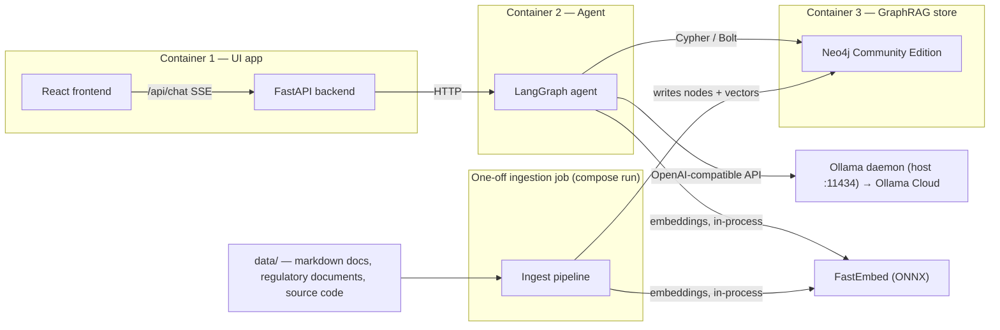

# GraphRAG Agent PoC

A proof-of-concept **GraphRAG-powered agent** that answers questions across an internal corpus of IT-architecture documents, security guidance (OWASP), Australian regulatory material (APRA CPS 234 / CPS 230, ASIC, AUSTRAC, ACCC), and source code — combining vector retrieval with knowledge-graph traversal to produce graph-grounded, **cited** answers.

The whole stack runs locally on a Mac (Rancher Desktop) with three Docker Compose containers:

1. **UI app** — React frontend + FastAPI backend for chat-style retrieval
2. **Agent** — a LangGraph agent with hybrid retrieval, Text2Cypher and agentic routing
3. **Neo4j** — Community Edition as the GraphRAG store

A one-off ingestion job loads and extracts the source documents into the graph.

> **Status:** implemented (all three containers + ingest pipeline; live-validated against the synthetic corpus with real Neo4j 5 and real extraction, two full runs incl. an idempotent re-ingest). Commands and ports below are the contract the implementation follows.

---

## Goals & non-goals

**Goals — the questions this PoC must answer:**

- Can a graph-backed agent connect *code-level controls* to their *governing regulatory clauses* (e.g. a repository control → CPS 234 clause) via multi-hop traversal?
- Does schema-guided GraphRAG extraction (via `neo4j-graphrag`) produce a graph worth traversing across three very different document classes?
- Is hybrid retrieval (dense + sparse + graph) measurably better than vector-only RAG on mixed structured/semi-structured/unstructured corpora?
- Are answers traceable — every claim backed by a citation to a source document/section (e.g. "CPS 234 ¶27")?

**Non-goals (out of scope for the PoC):**

- Production hardening: auth/RBAC, multi-tenancy, HA/clustering
- Fine-tuning or model training
- Deployment beyond a single Mac / Rancher Desktop
- Incremental/document-watcher ingestion (a roadmap item)

---

## Architecture



| Container | Tech | Responsibility | Port |
|---|---|---|---|
| 1 — UI app | React (Vite) + FastAPI (Uvicorn) | Chat UI; FastAPI proxies chat + streaming (SSE) to the agent over HTTP | `3000` (React), `8000` (FastAPI) |
| 2 — Agent | Python + LangGraph, `neo4j-graphrag` | Retrieval strategy routing, hybrid retrieval, Text2Cypher, citation assembly | `8001` |
| 3 — Neo4j | Neo4j Community Edition 5.x | Graph + vector store; single source of truth for the knowledge graph | `7474` (Browser), `7687` (Bolt) |
| ingest (one-off) | Python, `neo4j-graphrag`, FastEmbed | Parse, chunk, embed, extract entities/relations; writes to Neo4j. Run with `docker compose run --rm ingest` | — |

---

## Components

### 1. UI app (Container 1)

- **React (Vite)** single-page chat interface: message list with streaming responses, rendered citations linking to source documents/sections, and a collapsible panel showing the agent's retrieval steps (route chosen, queries issued, graph traversals).
- **FastAPI backend** in the same container: exposes `/api/chat` (SSE streaming), forwards to the agent container, relays token streams back to the browser.
- Rationale: keeps the three-container topology simple — the browser never talks to the agent directly.

### 2. Agent (Container 2) — LangGraph

The agent is a LangGraph state machine. Proposed node flow:

```
route → rewrite → retrieve → (traverse?) → synthesize → cite
                       ↑__________↓  (iterate if insufficient; max 3 iterations)
```

| Capability | Description |
|---|---|
| **Agentic routing** | Classifies the query intent (lookup / relationship / compliance-mapping) and selects a retrieval strategy; rewrites vague queries into retrieval-friendly forms. The retrieve→traverse loop exits when an LLM sufficiency check judges the context adequate to answer, or after **3 iterations** (hard cap — whichever comes first) |
| **Hybrid retrieval** | `neo4j-graphrag` retrievers over `Chunk` — dense (FastEmbed ONNX, 1024-dim vector index) + sparse (BM25, Neo4j full-text index) combined |
| **Text2Cypher** | Generates Cypher from the natural-language question against the known graph schema to traverse multi-hop relationships the vector index can't answer (e.g. *which code components relate to the control satisfying CPS 230 §23?*). Guardrails: the graph schema is injected into the prompt; generation happens on a **read-only** Neo4j session; generated statements are validated before execution; on validation/runtime error the agent retries with the error appended, bounded at 3 attempts, then falls back to hybrid retrieval |
| **Citations** | Every synthesized answer carries provenance: document id, title, section/heading, and clause number where applicable (regulatory docs keep their native numbering). Code citations use a different provenance shape: `path/to/file.py#symbol[:lines]` |

### 3. Neo4j GraphRAG store (Container 3)

Neo4j Community Edition (Docker image `neo4j:5-community`). Proposed schema:

```cypher
// Document + chunk layer (retrieval)
(:Document {id, title, type, source_path})-[:HAS_CHUNK]->(:Chunk {id, text, embedding, section})
// vector index on Chunk.embedding (1024-dim, cosine)
// full-text index on Chunk.text (BM25 sparse retrieval)

// Knowledge layer (extraction, via neo4j-graphrag schema-guided prompts)
// Typed labels + named relationships (NOT a generic (:Entity {type}) blob):
// a strongly-typed schema keeps the Text2Cypher prompt compact and the
// generated Cypher constrained. Labels below are representative; the
// authoritative schema is schema/graph_schema.yaml at the repo root,
// mounted read-only into BOTH the agent (Text2Cypher prompt) and the
// ingest job (extraction constraints) — one source of truth.
(:CodeComponent {id, name, path})          // from source code
(:Pattern        {id, name})               // from architecture / design docs
(:Risk           {id, name})
(:Control        {id, name, standard})     // from OWASP / security guidance
(:Obligation     {id, name, regulator})    // from regulatory material
(:CpsClause      {id, doc, number})        // e.g. CPS 234 clause 27

// Cross-class edges — the whole point of the PoC:
//   (:CodeComponent)-[:MITIGATES]->(:Risk)-[:GOVERNED_BY]->(:CpsClause)
//   (:Pattern)-[:ADDRESSES]->(:Risk)
//   (:Control)-[:IMPLEMENTS]->(:Obligation)
// Every knowledge edge carries provenance: {source_chunk, source_document}
```

Entities are **merged across documents** into one global graph, so relationships can span document classes — e.g. a code component in `data/code/` connecting to a clause in `data/regulatory/`. Per-document scoping would make the PoC's traversal questions unanswerable. Merging is **lexical**: names are normalized (case, whitespace, `-`/`_`) and deduplicated on `(label, normalized name)`. Deterministic and idempotent, but name variants across document classes ("auth-service" vs "the authentication service") stay separate nodes and fragment some potential cross-class edges — a known, accepted limitation (see Limitations & risks).

### 4. Ingestion job (one-off)

Runs as a compose service but only via `docker compose run --rm ingest`. Pipeline:

1. **Parse** — walk `data/`, classify each file by document class (below). PDFs are converted to markdown first (PDF extraction library, e.g. Docling) — conversion quality determines whether clause numbers survive into citations, so spot-check the markdown for the regulatory docs before ingesting.
2. **Chunk** — class-specific strategy:
   - *Code* → symbol/AST-aware chunking via `tree-sitter-python` (module, class, function boundaries) — the corpus is Python-only
   - *Semi-structured markdown* → heading-hierarchy chunking (keeps section paths for citations)
   - *Unstructured regulatory/security docs* → semantic chunking; preserve clause numbers as metadata
3. **Embed** — FastEmbed (ONNX, int8-quantized) in-process on CPU: `mixedbread-ai/mxbai-embed-large-v1`, 1024-dim dense. No GPU/MPS — Docker on macOS can't reach Apple MPS, so the model must be CPU-viable; the quantized ONNX build is.
4. **Extract** — `neo4j-graphrag` schema-guided entity/relation extraction with `glm-5.3-flash:cloud`, against the typed-label schema above.
5. **Write** — upsert `Document`/`Chunk` nodes; create/reuse the **vector index and the full-text index** (both are required: dense and sparse retrieval each target one). Merge entities across documents by `(label, normalized name)`; write edges with `{source_chunk, source_document}` provenance.

Idempotent: re-running replaces documents by `source_path` (re-ingest a file by re-running the job). Replacement is a `DETACH DELETE` of the document's `Chunk` nodes plus every knowledge edge whose provenance points at those chunks — stale edges never survive a re-ingest. Entity *nodes* are not deleted (they may be referenced by edges from other documents); a re-run re-merges them by `(label, name)`.

---

## Document corpus

| Class | Structure | Examples | Extraction / retrieval strategy |
|---|---|---|---|
| Structured | Source code | Application and platform repositories | Symbol-aware chunking; entities = components, modules, functions, data flows; retrieval via Text2Cypher + graph adjacency |
| Semi-structured | Markdown with headings | IT-architecture docs, design & pattern documents | Heading-based chunking preserving the heading path; entities = patterns, principles, systems, dependencies |
| Unstructured — regulatory | Policies/acts (markdown/PDF) | APRA **CPS 234** (information security), **CPS 230** (operational risk), ASIC, AUSTRAC, ACCC material | Semantic chunking with clause-number metadata; entities = obligations, control types, regulated entities, clauses |
| Unstructured — security | Standards & guides | OWASP (Top 10, ASVS, cheat sheets) | Semantic chunking; entities = vulnerabilities, controls, ASVS requirements — cross-linked to code and regulatory clauses |

The graph's value comes from **cross-class edges**: e.g. `(CodeComponent)-[:MITIGATES]->(:Risk)-[:GOVERNED_BY]->(:CpsClause)`.

---

## Models

| Role | Model | Access | Notes |
|---|---|---|---|
| Reasoning / generation / extraction | **`glm-5.3-flash:cloud`** | Local Ollama daemon (OpenAI-compatible), proxied to Ollama Cloud (Pro) | Used by the agent (synthesis, routing, rewriting) and by the ingestion job (entity/relation extraction) |
| Embeddings | **`mixedbread-ai/mxbai-embed-large-v1`** | In-process via **FastEmbed** (int8-quantized ONNX) | 1024-dim dense, strong fine-grained matching for clause↔code citations. CPU-only and container-friendly — no GPU/MPS needed. **The agent and ingest job must use the identical model** so queries and chunks share one vector space (`EMBEDDING_MODEL` enforces this) |

No LLM runs locally — the agent and ingestion job both call the Ollama API (local daemon proxying to Ollama Cloud), so containers stay small and CPU-only. Embeddings run in-process on CPU (quantized ONNX); sparse retrieval is BM25 over the Neo4j full-text index, not a model.

### Accessing Ollama Cloud (Pro subscription)

No API keys are managed by this project. The local Ollama daemon (port `11434`) proxies any `:cloud`-suffixed model up to Ollama Cloud, where the Pro subscription handles auth — the Pro API key lives in Ollama's own credential store (`~/.ollama`, set at sign-in) and clients never see it. Ollama accepts any bearer token for its API, so a dummy token suffices.

**Container wiring (default path):**

- `OLLAMA_BASE_URL=http://host.docker.internal:11434/v1` — containers reach the host-side daemon via `host.docker.internal` (Rancher Desktop provides this)
- `OLLAMA_API_KEY=ollama` — placeholder; the daemon accepts any token

**Direct cloud path (fallback):** if the local daemon isn't running (e.g. CI, another machine), set `OLLAMA_BASE_URL=https://ollama.com/v1` and put a real Ollama Cloud API key in `OLLAMA_API_KEY`.

**How the dev machine's Claude Code is wired (context, not part of the PoC runtime):** `~/.zshrc` exports `ANTHROPIC_BASE_URL=http://127.0.0.1:11434`, `ANTHROPIC_AUTH_TOKEN=ollama` and an empty `ANTHROPIC_API_KEY`, pointing Claude Code at the same local daemon; the default model is pinned in `~/.claude/settings.json` (`deepseek-v4-flash:cloud`). Two zsh aliases switch modes: `claude-local` (pins `glm-5.3-flash:cloud[1m]` via Ollama) and `claude-max` (unsets the exports and launches real Anthropic Claude). Same daemon as the PoC uses, different client.

---

## Repository structure (planned)

```
graphrag/
├── README.md
├── docker-compose.yml        # ui, agent, neo4j (long-running) + ingest (one-off)
├── .env.example              # template — copy to .env
├── data/                     # documents + code to ingest (git-ignored)
├── schema/                   # graph_schema.yaml — shared source of truth for ingest + agent
├── eval/                     # golden question set (in git); traces/ (git-ignored)
├── ui/                       # React frontend + FastAPI backend, Dockerfile
├── agent/                    # LangGraph agent, Dockerfile
└── ingest/                   # ingestion pipeline, Dockerfile
```

---

## Getting started

### Prerequisites

- macOS with [Rancher Desktop](https://rancherdesktop.io/) running (Docker Compose v2 compatible: enable *dockerd* as the container runtime)
- Ollama installed, the local daemon running (`ollama serve`, port `11434`) and signed in to a Pro subscription (credentials in `~/.ollama` — no API key handling in this project)
- 8 GB+ RAM available to Docker/Rancher Desktop (Neo4j is the heaviest service)

### Setup

```bash
# 1. Clone and enter the project
git clone <repo-url> && cd graphrag

# 2. Configure environment
cp .env.example .env
#    then edit .env — set Neo4j credentials (OLLAMA_* defaults work via the
#    local daemon; see "Accessing Ollama Cloud" under Models)

# 3. Place source documents
#    data/regulatory/   APRA CPS 234, CPS 230, ASIC, AUSTRAC, ACCC docs
#    data/security/     OWASP material
#    data/architecture/ architecture + design-pattern markdown
#    data/code/         source code to ingest

# 4. Start the three long-running services
#    (compose wires neo4j with a healthcheck; agent + ui depend_on it healthy)
docker compose up -d          # ui (3000), agent (8001), neo4j (7474/7687)

# 5. Run the one-off ingestion job
#    (depends_on neo4j healthy — Bolt is ready before parsing starts)
docker compose run --rm ingest

# 6. Open the UI
open http://localhost:3000
```

---

## Configuration reference

| Variable | Used by | Description |
|---|---|---|
| `OLLAMA_API_KEY` | agent, ingest | Placeholder (`ollama`) via the local daemon — any token is accepted; a real key only needed for direct `https://ollama.com/v1` access |
| `OLLAMA_BASE_URL` | agent, ingest | Default `http://host.docker.internal:11434/v1` (local daemon); fallback `https://ollama.com/v1` (direct cloud) |
| `OLLAMA_MODEL` | agent, ingest | Model tag — `glm-5.3-flash:cloud` |
| `NEO4J_URI` | agent, ingest | Bolt URI — `bolt://neo4j:7687` (in-network) |
| `NEO4J_USER` / `NEO4J_PASSWORD` | compose, agent, ingest | Neo4j auth (set a real password; don't ship defaults) |
| `EMBEDDING_MODEL` | agent, ingest | `mixedbread-ai/mxbai-embed-large-v1` — **must be identical for agent and ingest** (shared vector space) |
| `EMBEDDING_DIM` | agent, ingest | `1024` — must match the vector index |
| `RETRIEVAL_MODE` | agent | `hybrid` (default) or `vector` — the vector-only baseline used in evaluation |
| `CHUNK_SIZE` / `CHUNK_OVERLAP` | ingest | Semantic chunking parameters (regulatory + security docs) |
| `INGEST_CONCURRENCY` | ingest | Concurrent extraction LLM calls (default `6`, bounded for cloud rate limits) |
| `EXTRACT_MAX_TOKENS` | ingest | Base completion budget per extraction attempt (default `8192`, doubled on each retry — reasoning models spend completion tokens on their reasoning channel before emitting JSON) |
| `AGENT_PORT` / `UI_PORT` | compose | Published ports (defaults `8001` / `3000`) |

---

## PoC evaluation

The "hybrid is measurably better than vector-only" claim needs a baseline, so evaluation is **part of the PoC, not a deferred roadmap item**. Three pieces:

1. **Golden question set** — the sample questions below (plus more as they come up) live in `eval/golden_questions.jsonl` with expected citations and expected graph paths, committed before the UI exists.
2. **Retrieval traces** — every agent run logs one JSONL trace to `eval/traces/`: route chosen, rewritten query, queries issued, retrieved chunk ids + scores, traversed subgraph, iteration count, timings, and final citations. Traces are what make the comparison possible retroactively. **`eval/traces/` is git-ignored** — traces embed retrieved corpus text, which must never land in git history; only the golden question set is committed.
3. **Baseline toggle** — `RETRIEVAL_MODE=vector` runs the same pipeline with graph traversal and the sparse side disabled. Every golden question is run under both modes; the comparison is hybrid vs vector-only on the same questions.

Success will be assessed against sample questions that **cross document classes**, e.g.:

1. *"What does CPS 234 require for physical security of information assets, and where in our codebase is that control implemented?"* — regulatory → code traversal
2. *"Which OWASP control corresponds to the CPS 230 requirement for change management, and do our design patterns cover it?"* — security ↔ regulatory ↔ architecture
3. *"Which internal systems depend on components that touch customer data, and what AUSTRAC obligations apply?"* — multi-hop Text2Cypher
4. Citation audit: for N sampled answers, are all cited sections real, relevant, and correctly attributed?

(Results to be recorded here once the PoC is built.)

---

## Limitations & risks

- **Neo4j Community Edition** — no RBAC, no hot backups, single instance; acceptable for a PoC, not for shared production use.
- **Cloud LLM dependency** — all generation goes through Ollama Cloud (via the local daemon proxy): network-dependent, adds latency, and means document content (including regulatory material) leaves the machine during extraction/retrieval. Assess before ingesting anything sensitive.
- **Extraction cost** — schema-guided extraction is the most expensive step: every chunk goes to the cloud LLM, and `data/` is unbounded (whatever is dropped in). Size the corpus before the first ingest run and keep a rough token-cost expectation in mind.
- **Extraction quality** — the knowledge graph is only as good as `glm-5.3-flash:cloud`'s schema-guided extraction; wrong or missing edges degrade Text2Cypher answers. The PoC includes manual spot-checks of extracted edges.
- **PDF conversion quality** — clause numbers must survive PDF→markdown conversion or regulatory citations break; spot-check converted markdown before ingesting (see pipeline step 1).
- **Entity resolution is lexical** — cross-document merging matches on normalized `(label, name)` only; name variants across document classes stay separate nodes and fragment some cross-class edges. Accepted for the PoC (deterministic, idempotent); LLM-assisted reconciliation is a possible follow-up.
- **Mac resource limits** — FastEmbed (CPU) + Neo4j + three containers together need headroom; Neo4j heap kept modest (CE, single user).
- **Model availability** — `glm-5.3-flash:cloud` is the tag currently in use on this machine (a `[1m]` long-context variant also exists); confirm it's still offered under the Pro plan at build time. `OLLAMA_MODEL` makes switching a one-line change.

---

## Roadmap

- Streaming graph visualisation of retrieved subgraphs in the UI
- Watcher-based ingestion service (auto-ingest on `data/` changes)
- Automated evaluation runs in CI (retrieval recall, citation precision over the golden question set — the manual harness ships with the PoC)
- Auth on the FastAPI backend; Neo4j Enterprise upgrade path if multi-user is needed
- Local-model fallback (Ollama local) to remove cloud dependency

---

## References

- [APRA CPS 234 — Information Security](https://www.apra.gov.au/information-security)
- [APRA CPS 230 — Operational Risk Management](https://www.apra.gov.au/operational-risk)
- [OWASP](https://owasp.org/) — Top 10, ASVS, Cheat Sheets
- [neo4j-graphrag Python package](https://neo4j.com/docs/neo4j-graphrag-python/)
- [Neo4j Community Edition](https://neo4j.com/docs/operations-manual/current/installation/)
- [LangGraph](https://langchain-ai.github.io/langgraph/)
- [Ollama — Cloud models](https://docs.ollama.com/cloud)
- [mxbai-embed-large-v1 (Mixedbread)](https://huggingface.co/mixedbread-ai/mxbai-embed-large-v1)
- [FastEmbed](https://qdrant.github.io/fastembed/)
- [Rancher Desktop](https://docs.rancherdesktop.io/)